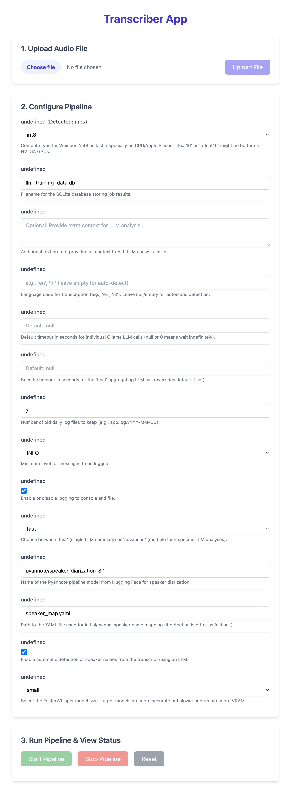

# TranscriberApp

A local web application for transcribing and analyzing audio files using local AI models (FasterWhisper, Pyannote, Ollama). Focuses on privacy and performance, with optimizations for Apple Silicon.

## Key Features

* **Transcription:** Audio-to-text using FasterWhisper.
* **Speaker Diarization:** Identifies speakers using Pyannote.audio.
* **Speaker Name Detection:** (Optional) LLM-based name proposal.
* **User Review:** UI step to confirm/edit speaker names before analysis.
* **LLM Analysis:** 'Fast' (summary) or 'Advanced' (multi-task) modes via local Ollama.
* **HTML Output:** Formatted transcript generation.
* **Database Logging:** Saves job results to SQLite.
* **Local & Private:** All core processing runs locally.
* **Apple Silicon Optimized:** Uses MPS acceleration.

## Technology Stack

* **Backend:** Python (3.11/3.12 recommended), Flask
* **Transcription:** FasterWhisper
* **Diarization:** Pyannote.audio
* **LLM Interaction:** Ollama
* **Database:** SQLAlchemy Core, SQLite
* **Audio Handling:** Pydub
* **Frontend:** Svelte, Vite, Tailwind CSS
* **Code Quality:** Ruff

## Demo / Screenshot



## Requirements

* **OS:** macOS (Apple Silicon recommended) or Linux. Windows might require adjustments.
* **Python:** **Python 3.11 or 3.12 strongly recommended.** (Version 3.13 currently has known compatibility issues with dependencies like `pydub`).
* **Node.js:** Required for the frontend (includes `npm`). Version 18+ recommended.
* **Ollama:** Installed and running ([ollama.com](https://ollama.com/)). Ensure required models are pulled (see Installation step 7).
* **Hugging Face Account & Token:**
    * Account needed to accept model terms on Hugging Face (especially for Pyannote).
    * Read Access Token required (store in `.env`).
* **System Dependencies:**
    * **macOS (via Homebrew):** Ensure [Homebrew](https://brew.sh/) is installed. Then run:
        ```bash
        brew install ffmpeg cmake pkg-config protobuf
        ```
    * **Debian/Ubuntu Linux:**
        ```bash
        sudo apt update && sudo apt install -y ffmpeg cmake pkg-config libprotobuf-dev protobuf-compiler
        ```
    * *(Other Linux/Windows: Install equivalent packages for ffmpeg, cmake, pkg-config, and protobuf development libraries).*

* **Python Packages:** Listed in `requirements.txt`.

## Installation

1.  **Clone the repository:**
    ```bash
    git clone [https://github.com/GPTSam/TranscriberApp.git](https://github.com/GPTSam/TranscriberApp.git)
    cd TranscriberApp
    ```
2.  **Create Python Virtual Environment:** (Use Python 3.11 or 3.12)
    ```bash
    # Replace python3.11 with your specific command if needed
    python3.11 -m venv venv
    ```
3.  **Activate Virtual Environment:**
    ```bash
    source venv/bin/activate
    # (Windows: venv\Scripts\activate)
    ```
    *(Your terminal prompt should now start with `(venv)`)*
4.  **Install System Dependencies:** (If not already installed - see Requirements)
    *(macOS example: `brew install ffmpeg cmake pkg-config protobuf`)*
5.  **Install Python Dependencies:**
    ```bash
    # Use the correct Python interpreter for make if needed
    make PYTHON_INTERPRETER=python3.11 install
    # Or directly with pip:
    # pip install --upgrade pip
    # pip install -r requirements.txt
    ```
6.  **Set up Hugging Face Token:**
    * Accept model terms on HF (e.g., `pyannote/speaker-diarization-3.1`).
    * Create a read Access Token in your [HF settings](https://huggingface.co/settings/tokens).
    * Create `.env` file: `cp .env.example .env`
    * Edit `.env` and add your token: `HUGGING_FACE_TOKEN=hf_YOUR_ACTUAL_TOKEN_HERE`
7.  **Download Ollama Models:** Pull the LLM models specified in `config.yaml` (or the defaults if you haven't edited it yet). At minimum for testing:
    ```bash
    ollama pull llama3:8b
    ollama pull mistral:7b # Often used for name detection/summary fallback
    # Pull others listed in config.yaml -> llm_models as needed
    ```
8.  **Generate/Check Configuration:**
    * Ensure `config_schema.yaml` exists and has content.
    * Generate the default `config.yaml` if it doesn't exist:
        ```bash
        # Run from project root, with venv active
        python -m src.utils.generate_config_from_schema
        ```
    * **Edit `config.yaml`:** Open `config.yaml` and **set `input_audio`** to a valid relative path for an audio file in the `audio/` directory (e.g., `audio/sample.mp3`). Review other settings like `whisper_model` and `llm_models` for your local setup.

## Usage

**Important:** Both the Backend and Frontend servers need to be running simultaneously for the Web UI.

**1. Run the Backend (Flask API Server):**

* Open **Terminal 1**.
* Navigate to the project root (`TranscriberApp`).
* Activate the Python venv: `source venv/bin/activate`
* Start the server:
    ```bash
    # Replace python3.11 if you used a different version for venv
    make PYTHON_INTERPRETER=python3.11 run-web
    # Or directly: python app.py
    ```
* Leave this terminal running. It serves the API on `http://localhost:5001`.

**2. Run the Frontend (Svelte Dev Server):**

* Open **Terminal 2**.
* Navigate to the `frontend` directory: `cd frontend`
* Install Node dependencies (only needed once): `npm install`
* Start the dev server:
    ```bash
    npm run dev
    ```
* Leave this terminal running. It serves the UI, usually on `http://localhost:5173`.

**3. Use the Web Interface:**

* Open your web browser and navigate to the frontend URL (e.g., `http://localhost:5173`).
* **Workflow:**
    1.  Use "Upload Audio File" to select and upload your audio. Wait for success message.
    2.  Adjust settings in the "Configure Pipeline" section if desired.
    3.  Click "Start Pipeline".
    4.  Monitor the "Job Status" section for progress updates and logs.
    5.  When the status becomes `WAITING_FOR_REVIEW`, the Review Dialog will appear.
    6.  Review the transcript context, assign/correct speaker names, and click "Confirm Names".
    7.  The pipeline (Part 2) will continue. Monitor status until `COMPLETED`.
    8.  Download links for results will appear in the status section.
    9.  Use "Stop Pipeline" to attempt cancellation or "Reset" to clear the state for a new run.

**4. Command Line Interface (Testing/Scripting):**

* Runs the full pipeline non-interactively. Review step is automatic.
* Ensure venv is active in your terminal.
* Examples (run from project root):
    ```bash
    # Use config.yaml settings (ensure input_audio is set)
    make PYTHON_INTERPRETER=python3.11 run-cli

    # Override input and run in advanced mode
    make PYTHON_INTERPRETER=python3.11 run-cli ARGS="--input-audio audio/my_audio.m4a --mode advanced"
    ```

## Output Files & Data

* `logs/`: Daily log files (`YYYY-MM-DD.log`).
* `transcripts/intermediate_transcript.json`: Raw diarized transcript.
* `transcripts/intermediate_proposed_map.json`: (Optional) LLM proposed map.
* `transcripts/intermediate_context.json`: (Optional) Context for name detection.
* `transcripts/final_transcript.json`: Transcript with final names.
* `results/transcript.html`: Formatted HTML transcript.
* `results/summary.txt`: 'Fast' mode output.
* `results/advanced_analysis.json`: 'Advanced' mode output.
* `llm_training_data.db`: SQLite DB with job results.

## Speaker Handling Process

1.  Diarization -> Speaker IDs (`SPEAKER_00`).
2.  Transcription -> Text segments.
3.  Merge -> Assign ID to text.
4.  (Optional) Name Detection -> Propose names.
5.  User Review -> Confirm/edit names.
6.  Final Mapping -> Apply names.

## Database Logging

Job results logged to `llm_training_data.db`.

## Troubleshooting

*(Expanded based on our findings)*

* **Pyannote/HF Token Errors:** Accept model terms on HF, check `.env` token.
* **Ollama Errors:** Ensure service running, models pulled. Check Ollama server logs.
* **Port Conflicts (5001):** Stop process using port (check with `lsof -i :5001`), change `FLASK_PORT`.
* **Python `ModuleNotFoundError`:** Ensure venv active, run `make ... install` or `pip install -r requirements.txt`.
* **Build Errors (`sentencepiece`):** Ensure system dependencies (`cmake`, `pkg-config`, `protobuf`) installed via package manager (e.g., Homebrew). Use Python 3.11/3.12, as 3.13 has issues (`audioop` missing).
* **Frontend `ERR_CONNECTION_REFUSED` (Port 5173):** Ensure frontend dev server (`npm run dev`) is running in the `frontend` directory.
* **Frontend API Errors (500 / SyntaxError):** Ensure backend server (`make ... run-web`) is running. Check backend terminal logs for tracebacks. Verify API proxy in `vite.config.js` targets the correct backend port (5001).
* **NPM `EACCES` Cache Errors:** Run the `sudo chown -R ...` command suggested by npm to fix cache permissions.
* **Performance:** Check logs for MPS/CUDA usage. Use smaller models / `int8`.

## Future Enhancements

* Implement transcript text editing.
* Add more analysis tasks.
* Improve UI feedback/visualization.

## License

MIT License - see [LICENSE](LICENSE) file.

## Author / Contact

Samuel Willems / Legendaddy / willems.samuel@gmail.com